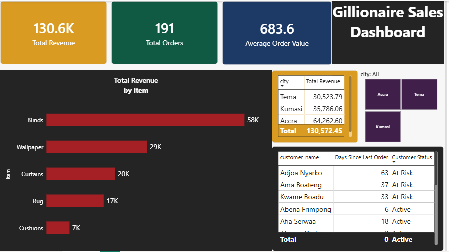
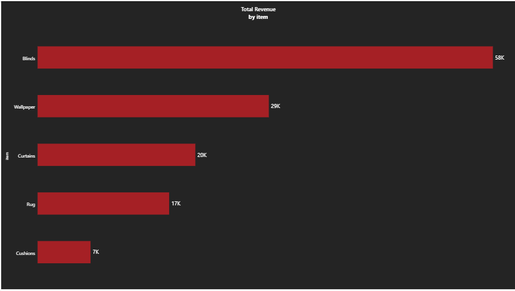
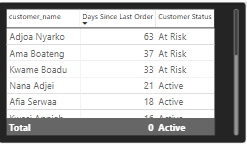

# Gillionaire Decor — Full Year Business Review (2026)

An end-to-end data analytics capstone: cleaning a real-world-style order dataset, answering five stakeholder questions with statistically validated findings, building a predictive model (and stress-testing it to confirm what it actually learned) — then independently re-validating the core analysis in SQL and Power BI to confirm the findings hold up across tools.

## Business Problem

Gillionaire Decor's owner needed a data-backed review of the business's first full year before setting 2027 strategy: which items and customers to prioritize, whether city-level performance differences are real, whether there's a seasonal pattern worth planning around, which customers are at risk of churning, and whether high-value orders can be predicted ahead of time for staffing/inventory planning.

## Dataset

- 197 raw order records (order_id, customer_name, item, city, amount, order_date)
- Real-world messiness: inconsistent name casing/whitespace, 3 missing amounts, 3 duplicate rows
- Cleaned to 191 valid records after documented removal of missing/duplicate rows

## Tools Used

Python (pandas, matplotlib), scipy (statistical testing), scikit-learn (RandomForestClassifier), MySQL, Power BI (DAX)

## Methodology

1. **Data cleaning** — verified missing values, duplicates, and whitespace/casing issues column-by-column rather than assuming only the obvious column was affected; later replicated entirely in MySQL, including solving MySQL's lack of a built-in PROPER()/title-case function
2. **Descriptive analysis** — revenue and order count by item, customer (RFM-style: recency, frequency, monetary), and city
3. **Statistical validation** — one-way ANOVA to test whether the observed city revenue difference is statistically significant, rather than assuming a visible gap is meaningful
4. **Churn/retention segmentation** — recency-based at-risk detection (30+ days since last order), enriched with each customer's order history and revenue-weighted favorite item; replicated independently in SQL and as a Power BI dashboard table
5. **Predictive modeling** — RandomForestClassifier predicting whether a new order will be "high-value" (top 25% of order amounts), using city, item, month, and day-of-week as features
6. **Model validation (ablation test)** — retrained the same model with `item` removed, and compared against a naive baseline (always predicting the majority class), to determine whether the model had learned a genuine new pattern or was mostly re-expressing the known item-price relationship
7. **Cross-tool validation** — the cleaning and churn-detection logic was rebuilt independently in SQL and Power BI/DAX, surfacing and fixing two genuine reference-date bugs (a hardcoded cutoff date in SQL, and Power BI's `TODAY()` function returning the system date instead of the dataset's latest order date) before all three tools' outputs matched exactly

## Key Findings

| Question | Finding |
|---|---|
| Top items | Blinds led on total revenue (GHC 57,785.89 across 54 orders); Wallpaper had the highest average order value |
| Top customer | Abena Frimpong (GHC 13,729.79 across 18 orders) |
| City difference | Accra leads in total revenue (GHC 64,262.60 vs Kumasi's 35,786.06 and Tema's 30,523.79), but a one-way ANOVA (F=1.64, p=0.196) found **no statistically significant difference** in average order value between cities — Accra's revenue lead is driven by order volume, not by individual orders being larger |
| Seasonality | Order volume rose sharply toward year-end (23 orders in November, 27 in December, vs. 8 in February) — a real, directly observed pattern worth planning inventory/staffing around |
| Churn risk | 3 customers flagged at 30+ days since last order (Adjoa Nyarko, Ama Boateng, Kwame Boadu), independently confirmed identical across Python, SQL, and Power BI, each enriched with order history and revenue-weighted favorite item to support personalized re-engagement outreach |
| Predictive model | RandomForestClassifier reached 84.6% accuracy predicting high-value orders — but an ablation test (removing `item`) showed accuracy without it (71.8%) falls *below* the naive baseline (79.5%), revealing the model's real predictive power comes almost entirely from item type, not from timing or location |

## Lessons Learned

The most important finding in this project wasn't a number — it was a validation habit. A high-accuracy model can look impressive while mostly re-discovering a pattern already visible in a simple boxplot; a dashboard can look complete while silently using the wrong reference date. Comparing the model against a naive baseline, and rebuilding the core analysis independently in SQL and Power BI, is what caught two real bugs (a hardcoded SQL date, a `TODAY()` DAX mistake) that would otherwise have shipped as confidently wrong numbers.

## Files

- `gillionaire_2026_full_year.csv` — raw dataset
- `gillionaire_capstone_cleaned.csv` — cleaned dataset (191 rows)
- `gillionaire_capstone_setup.sql` — MySQL import script
- Jupyter notebook — full Python analysis, statistical tests, and model code
- Power BI dashboard (.pbix) — KPI cards, item/city breakdowns, churn table, city slicer

## Dashboard Preview

**Revenue by item:**

**At-risk customers:**

